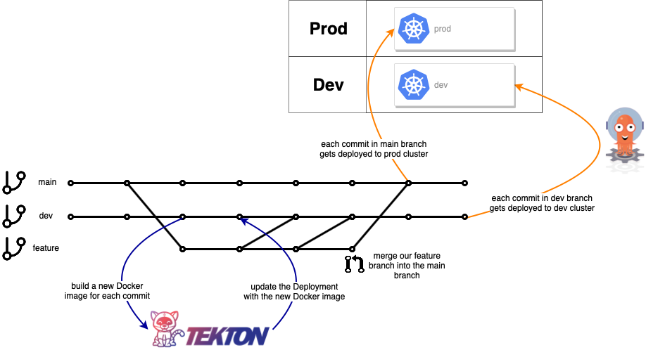
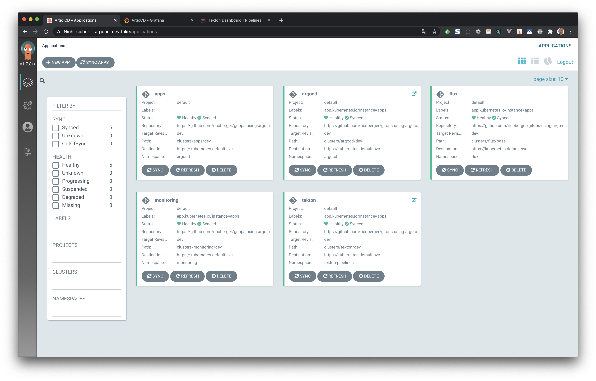
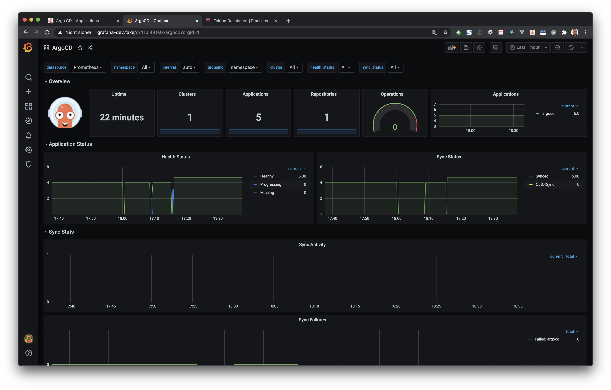
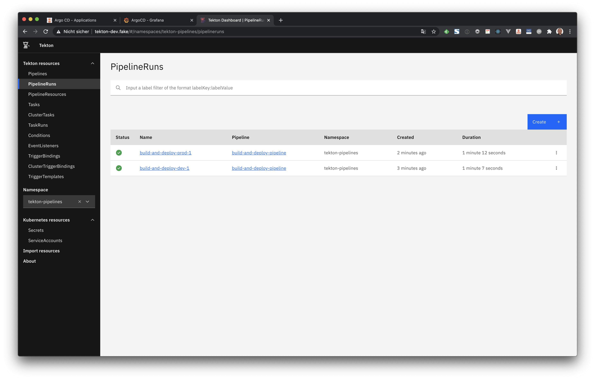

# GitOps using Argo CD and Tekton

This repository demonstrates a possible GitOps workflow using [Argo CD](https://argoproj.github.io/projects/argo-cd) and [Tekton](https://tekton.dev). We are using Argo CD to setup our Kubernetes clusters `dev` and `prod` (in the following we will only use the `dev` cluster) and Tekton to build and update our example application.



## Argo CD

In the first step we are creating a new Kubernetes cluster using Minikube and we enable the NGINX Ingress controller:

```sh
minikube start --driver=virtualbox --cpus=4 --memory=8192m --profile=dev
minikube addons enable ingress --profile=dev
```

In the next step we have to to install Argo CD by running the following command:

```sh
kustomize build clusters/argocd/dev | k apply -f -
```

After some minutes we have to verify that Argo CD is running:

```sh
kubectl get pods -n argocd
```

```txt
argocd-application-controller-75b4dcd7bb-97wm8   1/1     Running   0          3m50s
argocd-dex-server-996685b6d-zffmd                1/1     Running   0          3m50s
argocd-redis-99fb49846-pqn7p                     1/1     Running   0          3m50s
argocd-repo-server-5c76bd686b-79gjn              1/1     Running   0          3m49s
argocd-server-67885bdcff-5q5cz                   1/1     Running   0          3m49s
```

To deploy our manifests to the cluster we are using the **app of apps** pattern. For that we have to create a new `Application`, which manages all other applications (including Argo CD):

```sh
kubectl apply -f clusters/apps/dev.yaml
```

Now we have to add our Ingresses to the `/etc/hosts` file:

```sh
sudo echo "`minikube ip --profile=dev` argocd-dev.fake grafana-dev.fake prometheus-dev.fake tekton-dev.fake server-dev.fake" | sudo tee -a /etc/hosts
```

Now we can visit [argocd-dev.fake](https://argocd-dev.fake) and login with the default `admin` user. The initial password is autogenerated to be the pod name of the Argo CD API server. This can be retrieved with the command:

```sh
kubectl get pods -n argocd -l app.kubernetes.io/name=argocd-server -o name | cut -d'/' -f 2
```

In the UI of Argo CD we can now see all deployed applications:



This example also deploys the Prometheus Stack via the [kube-prometheus-stack](https://github.com/prometheus-community/helm-charts/tree/main/charts/kube-prometheus-stack) Helm chart. We are using the [Flux Helm Operator](https://docs.fluxcd.io/projects/helm-operator/en/stable/) instead of the Argo CD to deploy the Helm chart. When the Helm chart was successfully synced Prometheus is available at [prometheus-dev.fake](https://prometheus-dev.fake) and Grafana at [grafana-dev.fake](https://grafana-dev.fake).

In the next step we can login to Grafana with the `admin` user and the password `admin`. Then we can import the example Dashboard for Argo CD. The dashboard can be found in the GitHub repository of the Argo CD project at [https://github.com/argoproj/argo-cd/blob/master/examples/dashboard.json](https://github.com/argoproj/argo-cd/blob/master/examples/dashboard.json).



## Tekton

> **NOTE:** To deploy Tekton using Argo CD we had slightly adjusted the following files:
>
> - [tekton-dashboard-release.yaml](https://storage.googleapis.com/tekton-releases/pipeline/latest/release.yaml)
> - [tekton-pipeline-release.yaml](https://storage.googleapis.com/tekton-releases/triggers/latest/release.yaml)
> - [tekton-triggers-release.yaml](https://github.com/tektoncd/dashboard/releases/latest/download/tekton-dashboard-release.yaml)
>
> We had to remove the `preserveUnknownFields` field from all CRDs and we had to change the `app.kubernetes.io/instance` label from `default` to `tekton` for all manifests.

We are using Tekton Pipelines to build our example application and to update the deployed Docker image. The required tasks and pipelines are deployed by Argo CD, but we have to manually provide the credentials for Docker Hub and GitHub. To create the secrets we have to run the following commands:

```sh
kubectl create secret docker-registry docker-registry-secret --docker-server="https://index.docker.io/v1/" --docker-username=<DOCKER_USERNAME> --docker-password=<DOCKER_PASSWORD>
kubectl annotate secret docker-registry-secret tekton.dev/docker-0=https://index.docker.io/v1/
kubectl create secret generic github-secret --type="kubernetes.io/basic-auth" --from-literal=username=<GITHUB_USERNAME> --from-literal=password=<GITHUB_PASSWORD>
kubectl annotate secret github-secret tekton.dev/git-0=https://github.com
```

> In a production ready setup, we should use the [Vault Secrets Operator](https://github.com/ricoberger/vault-secrets-operator) or a similar tool to manage our secrets.

When we have created the secrets, we can run our pipeline, to build a new Docker image for the development and production environment:

```sh
cat <<EOF | kubectl create -f -
apiVersion: tekton.dev/v1beta1
kind: PipelineRun
metadata:
  name: build-and-deploy-dev-1
  annotations:
    argocd.argoproj.io/compare-options: IgnoreExtraneous
spec:
  pipelineRef:
    name: build-and-deploy-pipeline
  params:
    - name: gitUrl
      value: https://github.com/ricoberger/gitops-using-argo-cd-and-tekton
    - name: gitRevision
      value: dev
    - name: imageUrl
      value: ricoberger/gitops-using-argo-cd-and-tekton
    - name: serviceName
      value: server
    - name: filePath
      value: clusters/server/dev/server-deploy.yaml
    - name: yamlField
      value: spec.template.spec.containers[0].image
  serviceAccountName: pipeline-account
  workspaces:
    - name: git-source
      persistentVolumeClaim:
        claimName: git-source-pvc
EOF
```

```sh
cat <<EOF | kubectl create -f -
apiVersion: tekton.dev/v1beta1
kind: PipelineRun
metadata:
  name: build-and-deploy-prod-1
  annotations:
    argocd.argoproj.io/compare-options: IgnoreExtraneous
spec:
  pipelineRef:
    name: build-and-deploy-pipeline
  params:
    - name: gitUrl
      value: https://github.com/ricoberger/gitops-using-argo-cd-and-tekton
    - name: gitRevision
      value: main
    - name: imageUrl
      value: ricoberger/gitops-using-argo-cd-and-tekton
    - name: serviceName
      value: server
    - name: filePath
      value: clusters/server/prod/server-deploy.yaml
    - name: yamlField
      value: spec.template.spec.containers[0].image
  serviceAccountName: pipeline-account
  workspaces:
    - name: git-source
      persistentVolumeClaim:
        claimName: git-source-pvc
EOF
```

Now we can visit [tekton-dev.fake](http://tekton-dev.fake/#/namespaces/tekton-pipelines/pipelineruns) to see the results of our above pipeline runs.



When the pipeline ran successfully, we can also watch the Pods in the `server` Namespace, were we can see that our example application is automatically updated after some time:

```sh
k get pods -w --namespace server
```

```txt
NAME                     READY   STATUS    RESTARTS   AGE
server-cbfbc758f-7w6lx   1/1     Running   0          14s
server-cbfbc758f-7w6lx   1/1     Terminating   0          24s
server-cbfbc758f-7w6lx   0/1     Terminating   0          25s
server-cbfbc758f-7w6lx   0/1     Terminating   0          26s
server-cbfbc758f-7w6lx   0/1     Terminating   0          26s
server-5b5c778558-2krtw   0/1     Pending       0          0s
server-5b5c778558-2krtw   0/1     Pending       0          0s
server-5b5c778558-2krtw   0/1     ContainerCreating   0          0s
server-5b5c778558-2krtw   0/1     Running             0          1s
server-5b5c778558-2krtw   1/1     Running             0          8s
```

We can also visit [server-dev.fake](http://server-dev.fake/) were we should see the greeting `Hello World`. When we change line 25 in the `cmd/server/server.go` file and merge our changes to the `dev` branch and rerun our pipeline, we should also see an updated greeting.

Instead of manually running our pipeline, we can also use [Tekton Triggers](https://github.com/tektoncd/triggers) in the future to run our pipeline on each commit to the `dev` and `main` branch.
